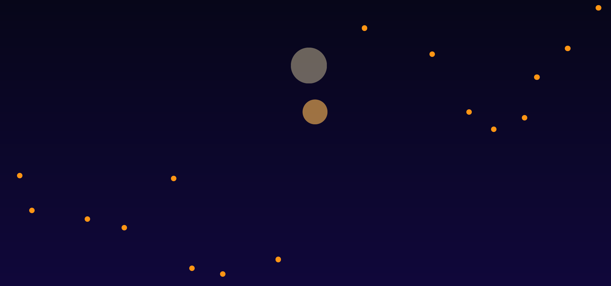
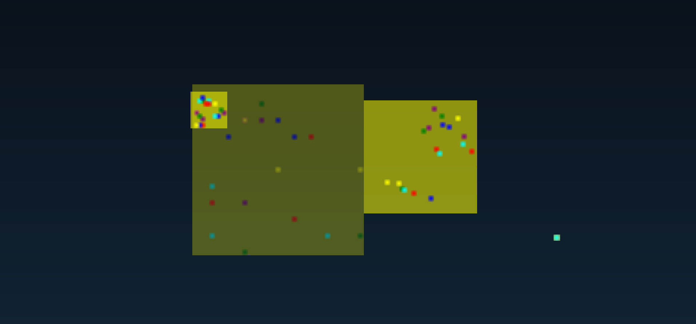
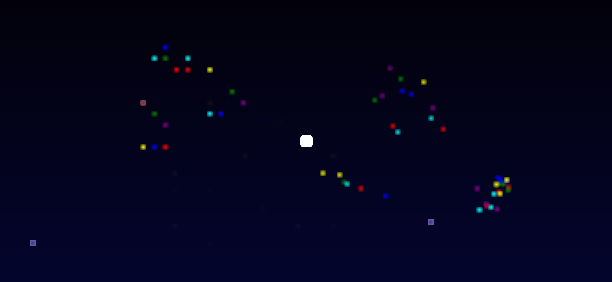
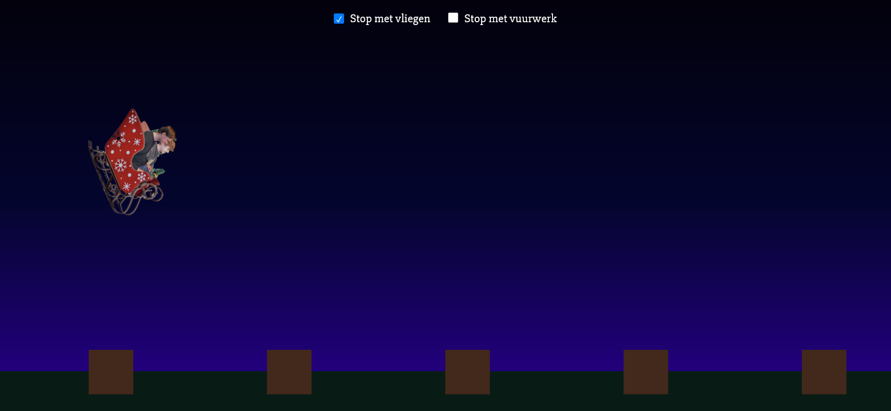

In de eerste week heb ik een introductieopdracht gekregen. In deze introductieopdracht moest ik op basis van eigen CSS code een bepaald CSS onderwerp uitleggen. In mijn geval was dit de :has selector. Deze heb ik samen met een klasgenoot gepresenteerd. 

# Week 2

### Eerste Project

In de tweede week ben ik begonnen aan de eindopdracht. 

Ik heb de ‘vuurwerkshow’ opdracht gekozen. In deze opdracht is aan mij de vraag om een *onvergetelijke magische dynamische* CSS vuurwerkshow te creëren. Er zijn twee eisen voor deze opdracht: 1. Creëer een dynamische CSS-only vuurwerkshow; 2. De gebruiker kan de show beïnvloeden.

Deze week heb ik een klein begin gemaakt. Omdat ik vrij nieuw ben met HTML en CSS, was ik vooral aan het kloten met de nieuwe lesstof. Mijn eerste idee was om een scherm vol sterren te maken, en deze een animatie te geven wanneer je er op klikt, waardoor er vuurwerk ontstaat. Helaas kreeg ik het niet voor elkaar om dit te laten werken, omdat de animatie elke keer reset als je op een andere ster klikt, waardoor de ster weer terugkeert op het scherm.

Eerste project

Ik heb met die project geleerd hoe ik de :checked selector kan gebruiken om een label van een checkbox van styling kan laten veranderen. Omdat je in dit project geen id’s of classes mag gebruiken, moest ik met selectors te werk gaan, waardoor ik geleerd heb met :nth-child() en :nth-of-type() te werken.

### Tweede Project

Dus heb ik besloten om voor iets anders te gaan, wat iets simpeler was maar ook iets haalbaarder. Het idee achter dit tweede project was om een normale vuurwerk interactief te maken, waarmee de gebruiker op knoppen kan klikken om vuurwerk te pauzeren en te activeren.

Tweede Project

Ik heb de vuurwerk gemaakt met een radial gradient.  Ik heb dit aan de hand van een [tutorial](https://www.youtube.com/watch?v=DV-guWlH3mM&t=664s&ab_channel=fakebeardprogramming) gedaan. Ik heb hierdoor geleerd hoe ik radial gradients kan gebruiken. In dit geval heb ik dit gedaan door veel verschillende radial-gradients te maken, en deze op verschillende plekken binnen de width en height te plaatsen. De background-size zet ik dan op dezelfde width en height. In de animatie laat ik de width en height vergroten, waardoor de radial-gradients meegaan met de width en de height. De gele background heb ik toegevoegd om te zien hoe de radial-gradients verspreid worden.

Alhoewel ik trots was op het resultaat, de opdracht was om de vuurwerkshow interactief te maken. 

# Week 3

### Derde Project

Omdat mijn vorige project niet interactief was, ging ik verder werken met het vuurwerk van het tweede project en de :checked functie uit het eerste project en kon hiermee een interactieve vuurwerkshow maken. De witte vierkant in het midden is een checkbox, en als je deze aanvinkt activeer je de vuurwerkshow. Als je weer op de checkbox klikt, pauzeer je de vuurwerkshow. 

Derde Project

Ook al werkt dit, vond ik het een beetje mager. Dus ging ik met wat ik geleerd heb verder naar een volgend project.

### Vierde Project

In dit project wilde ik wat meer interactie toevoegen. Inplaats van de gebruiker alleen een optie te geven om de vuurwerk te activeren en te pauzeren, wil ik ook dat de gebruiker een motion path kan activeren en pauzeren. Ik heb hiervoor twee van mijn klasgenoten in een kerstslee gezet en ze een ritje laten maken aan de hand van een motion-path. 

Vierde Project

Het was me gelukt om beide animaties interactief te maken. Met de checkboxes boven in de foto kan je de slee op stop zetten en kan je het vuurwerk op stop zetten.

## Wat ik heb geleerd

Kort samengevat, wat zijn de dingen die ik geleerd heb tijdens dit project?

<li>
  <ul>Het gebruiken van andere selectors, zoals de has: selector of de :checked selector</ul>
